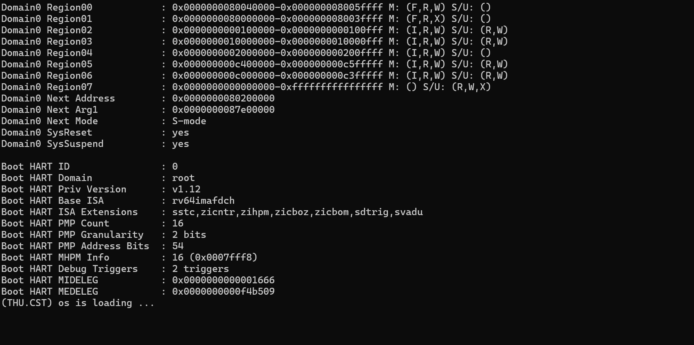
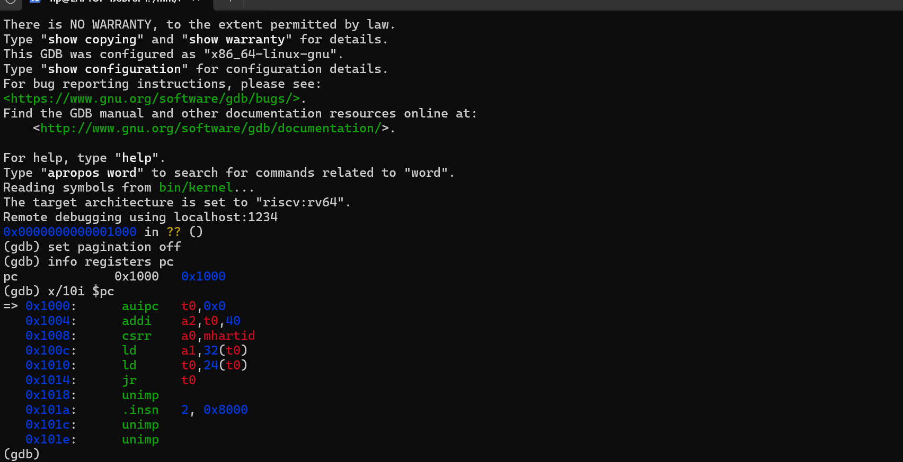
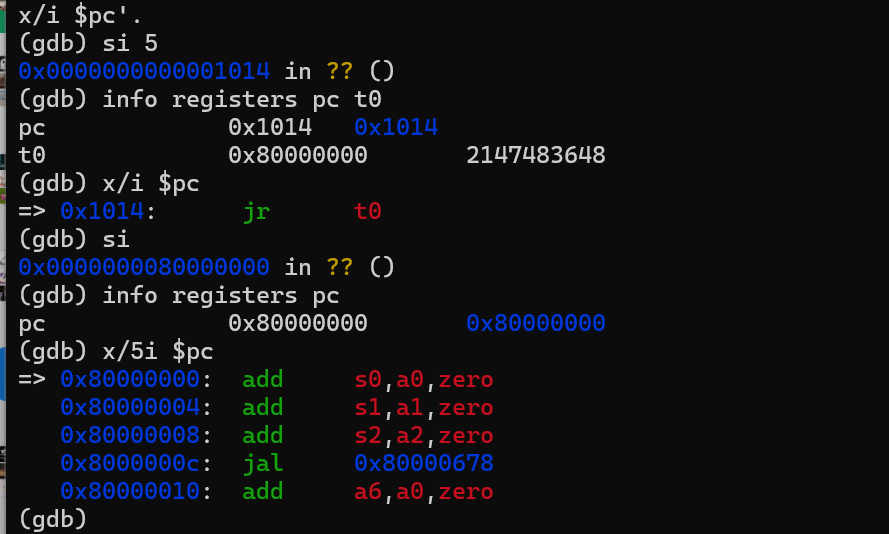
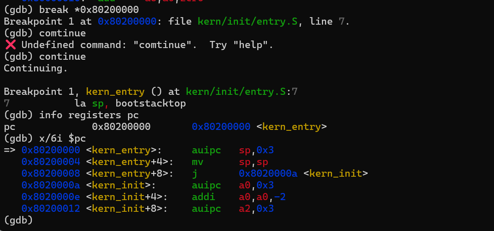
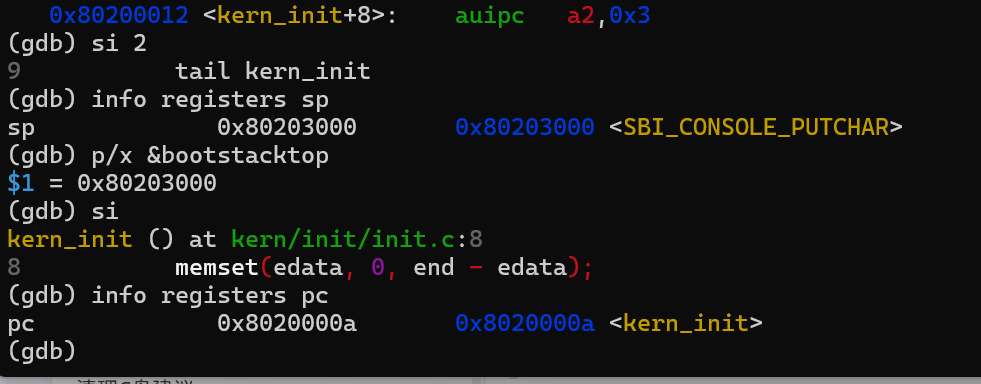

# 操作系统实验报告

## Lab1：比麻雀更小的麻雀（最小可执行内核）

> 代码仓库参考：https://github.com/liujiawen2005/OSlab/tree/lab1/code  
> 工作目录：`labcodes/lab1`（或本仓库 `code/`）  
> 报告格式：Markdown（`.md`），以文字说明为主

---

## 实验基本信息

| 项目 | 内容 |
| ---- | ---- |
| **实验名称** | Lab1：比麻雀更小的麻雀（最小可执行内核） |
| **小组成员** | 2411820-刘家文，2414004-王乐，2413994-陈宇凡 |
| **完成日期** | 2026-10-8 |
| **代码路径** | https://github.com/liujiawen2005/OSlab/tree/lab1/code（Makefile、kern/、libs/、tools/） |
| **报告存放** | https://github.com/liujiawen2005/OSlab/tree/lab1/report |

### 小组分工

**实验如何分工？**

| 成员 | 负责的练习 / 模块 |
| ---- | ----------------- |
| 2411820-刘家文 | 练习1 / entry.S 分析 |
| 2414004-王乐 | 练习2 / GDB 启动流程 |
| 2413994-陈宇凡 | 实验流程梳理和报告撰写 |


---

## 一、实验目的

本实验主要讲解**最小可执行内核**和**启动流程**。内核在 QEMU 模拟的 **64 位 RISC-V** 计算机上运行；为正确对接 QEMU，需了解启动流程、程序内存布局以及编译链接等相关知识。

本实验的主要目的是：

1. 使用**链接脚本**描述内存布局
2. 进行**交叉编译**生成可执行文件，进而生成内核镜像
3. 使用 **OpenSBI** 作为 bootloader 加载内核镜像，并用 **QEMU** 进行模拟
4. 使用 OpenSBI 提供的服务，在屏幕上**格式化打印字符串**以便后续调试
5. 构建仅具备「格式化输出 + 死循环」功能的最小可执行内核（麻雀骨架）

---

## 二、实验环境

### 2.1 软硬件 / 工具链（按实际填写）

| 项目 | 内容 |
| ---- | ---- |
| 宿主机系统 | Windows + WSL2 Ubuntu |
| 目标架构 | RISC-V 64（`riscv64`） |
| 交叉编译器 | `riscv64-unknown-elf-gcc` 等 |
| 模拟器 | `qemu-system-riscv64` |
| Bootloader / Firmware | OpenSBI（QEMU `-bios default`） |
| 调试器 | `gdb-multiarch` |
| 构建工具 | GNU Make（根目录 `Makefile` + `tools/function.mk`） |

### 2.2 AI 工具使用情况

| 成员 | AI 编程工具 | 底层模型 | 备注 |
| ---- | ----------- | -------- | ---- |
| （2414004-王乐） | Cursor | 豆包 |  |
| （2411820-刘家文） | codex | gpt-6 |  |
| 2413994-陈宇凡 | Cursor | Claude Opus 5.5 |  |

**说明：**

- **AI 编程工具**：指具体使用的终端工具、编辑器插件、桌面应用或浏览器界面
- **底层模型**：指该工具使用的大语言模型及版本

---

## 三、实验整体逻辑分析

### 3.1 本章节的逻辑主线

- 本章核心主题：最小可执行内核、启动流程、交叉编译与链接、OpenSBI 服务
- 要解决的问题：如何让一份极简内核在 QEMU + OpenSBI 环境下跑起来，并完成格式化输出后进入死循环
- 「麻雀骨架」含义：相对完整 ucore 进一步精简，先抓住启动与输出主线，再逐步加回功能

### 3.2 功能的逐步实现 / 执行顺序

1. **链接脚本约定入口与加载地址**（`tools/kernel.ld`：`ENTRY(kern_entry)`，`BASE_ADDRESS = 0x80200000`）
2. **交叉编译 + 链接**生成 `bin/kernel`（ELF），再 `objcopy` 得到 `bin/ucore.img`
3. **`make qemu`**：QEMU `-machine virt -bios default -kernel ...`，由 OpenSBI 加载并跳转内核
4. **上电复位 → MROM(`0x1000`) → OpenSBI(`0x80000000`) → 内核(`0x80200000`)**
5. **`kern/init/entry.S`**：设置栈指针，跳转到 `kern_init`
6. **`kern_init`**：清 BSS、`cprintf` 输出，进入死循环

### 3.3 关键文件与目录（对照仓库）

| 路径 | 作用（简述） |
| ---- | ------------ |
| `Makefile` | 编译、链接、生成镜像、`qemu` / `debug` / `gdb` 目标 |
| `tools/function.mk` | Makefile 辅助函数 |
| `tools/kernel.ld` | 链接脚本：入口、基址、段布局 |
| `kern/init/entry.S` | 内核汇编入口：设栈、`tail kern_init` |
| `kern/init/init.c` | `kern_init`：清 BSS、格式化输出、死循环 |
| `libs/` | 基础库（`sbi`、`stdio`、`printfmt`、`string` 等） |
| `kern/driver/` | 设备相关（如 console） |
| `kern/mm/` | 内存布局相关头文件（`memlayout.h`、`mmu.h`） |
| `kern/libs/stdio.c` | 内核侧格式化输出封装 |

---

## 四、实验内容与实现

### 练习题

#### 练习1：理解内核启动中的程序入口操作

**负责人：** （人工填写：2411820-刘家文）

阅读 `kern/init/entry.S`，结合操作系统内核启动流程，说明：

##### （1）`la sp, bootstacktop` 这条指令做了什么？目的是什么？

**答：**
`la` 是加载地址的伪指令。这条指令将符号 `bootstacktop` 对应的地址写入栈指针寄存器 `sp`，使其指向内核预留栈空间的顶部。

代码通过 `.space KSTACKSIZE` 预留栈空间，并在其末尾定义 `bootstacktop`。本实验中，`KSTACKSIZE = 2 × PGSIZE`，每页为 4096 字节，因此内核栈大小为 8192 字节，即 8 KiB。栈按照调用约定向低地址方向增长，所以初始栈指针设置在高地址端。

这条指令的目的，是在进入 C 函数前建立可用的内核栈。后续函数调用可能需要通过栈保存寄存器、局部变量等数据。如果没有正确设置栈指针，可能覆盖其他内存或导致异常。

需要区分的是：栈空间由汇编文件中的 `.space` 预留，`la sp, bootstacktop` 负责设置栈指针，并不是动态申请内存。

在本次生成的机器码中，这条伪指令对应：

```asm
auipc sp,0x3
mv    sp,sp
```

在内核入口执行 `si 2` 后，分别检查 `sp` 和 `bootstacktop` 的地址，得到：

```text
sp            = 0x80203000
&bootstacktop = 0x80203000
```

二者一致，说明内核栈指针初始化正确。

（人工填写）

##### （2）`tail kern_init` 这条指令做了什么？目的是什么？

**答：**
`tail kern_init` 是尾调用伪指令，将执行流程转移到 C 语言函数 `kern_init`，且不为本次跳转设置新的返回地址。

其目的是在汇编代码完成栈初始化后，将后续初始化工作交给 C 代码。`kern_init` 被声明为不返回的函数，并在完成初始化和输出后进入无限循环，因此不需要返回汇编入口继续执行。

本次反汇编结果显示，这条指令被优化为直接跳转：

```asm
j 0x8020000a <kern_init>
```

单步执行后，GDB 显示：

```text
pc = 0x8020000a <kern_init>
```

这证明执行流程已经进入 `kern_init`。该函数依次清零 `edata` 到 `end` 之间覆盖 BSS 的内存区域，调用 `cprintf` 输出启动信息，最后进入 `while (1)` 无限循环。

因此，两条入口指令共同完成了“准备内核栈，再进入 C 语言初始化函数”的工作。


（人工填写）

---

#### 练习2：使用 GDB 验证启动流程

**负责人：** （人工填写：2414004-王乐）

从 CPU 加电到执行第一条内核指令（跳转到 `0x80200000`），用 GDB 跟踪并回答：

##### （1）RISC-V 硬件加电后最先执行的几条指令位于什么地址？

**答：**
在本次 QEMU 模拟的 RISC-V `virt` 平台中，CPU 复位后的初始执行地址为 `0x1000`。

使用 `make debug` 启动并暂停模拟 CPU，再通过 `make gdb` 连接后，执行：

```gdb
info registers pc
x/10i $pc
```

观察到：

```text
pc = 0x1000
```

此处是一段位于 MROM 中的复位代码，负责准备启动参数，并将控制权转交给下一阶段的 OpenSBI。

`0x1000` 是本次模拟平台的复位地址，不代表所有 RISC-V 处理器都必须使用这一地址。

（人工填写）

##### （2）这些指令主要完成了什么功能？

**答：**
本次观察到的最初六条指令如下：

| 地址 | 指令 | 主要功能 |
| --- | --- | --- |
| `0x1000` | `auipc t0,0x0` | 将当前指令地址写入 `t0`，作为后续寻址基准 |
| `0x1004` | `addi a2,t0,40` | 将固件启动信息的地址 `0x1028` 写入 `a2` |
| `0x1008` | `csrr a0,mhartid` | 读取当前硬件线程编号，作为启动参数传入 `a0` |
| `0x100c` | `ld a1,32(t0)` | 从 `0x1020` 读取设备树地址，写入 `a1` |
| `0x1010` | `ld t0,24(t0)` | 从 `0x1018` 读取下一阶段入口地址，写入 `t0` |
| `0x1014` | `jr t0` | 跳转到 `t0` 指定的位置，本次为 `0x80000000` |

这些指令主要完成启动参数准备和控制权转移：提供硬件线程编号、设备树地址及固件启动信息，然后进入 OpenSBI。

调试中，执行前五条指令后观察到：

```text
pc = 0x1014
t0 = 0x80000000
```

此时即将执行 `jr t0`。再单步执行一次后：

```text
pc = 0x80000000
```

说明 CPU 已进入 OpenSBI。

随后，在内核入口设置断点：

```gdb
break *0x80200000
continue
```

程序命中断点，停在 `kern/init/entry.S` 中的第一条入口指令，PC 为：

```text
pc = 0x80200000 <kern_entry>
```

由此验证本次启动的关键执行路径为：

```text
复位代码 0x1000
→ OpenSBI 0x80000000
→ 内核入口 kern_entry 0x80200000
→ 设置内核栈
→ kern_init
```

本次采用复位代码单步执行和内核入口断点相结合的方法，没有逐条跟踪 OpenSBI 内部所有指令。

另外，在当前 QEMU 启动方式下，固件和内核镜像由 QEMU 放入模拟内存，OpenSBI 负责底层初始化并将控制权交给内核。因此，上述断点验证的是执行流程到达内核入口，而不是观察内核镜像加载瞬间。


（人工填写）


## 六、测试与验证

### 6.1 编译与正常启动验证

以下命令按整理后的 `code/` 目录给出。在 Ubuntu 中进入源码目录并编译、运行：

```bash
cd "/mnt/f/study/6/操作系统/lab1/code"
make
make qemu
```

构建过程先将 C 和汇编源码编译为目标文件，再依据 `tools/kernel.ld` 链接生成 ELF 文件 `bin/kernel`，最后通过 `objcopy` 生成二进制镜像 `bin/ucore.img`。

运行后，终端先显示 OpenSBI 信息，随后输出：

```text
(THU.CST) os is loading ...
```

这说明执行流程已进入内核，并完成启动信息输出。之后内核停留在 `kern_init` 中的无限循环，符合本实验代码的预期行为。



### 6.2 初始执行地址验证

退出正常运行的 QEMU 后，在第一个 Ubuntu 终端中执行：

```bash
make debug
```

该目标使用 `-S` 暂停模拟 CPU，并使用 `-s` 开启供 GDB 连接的调试端口。

在第二个 Ubuntu 终端中进入相同目录并连接：

```bash
cd "/mnt/f/study/6/操作系统/lab1/code"
make gdb
```

在 GDB 中输入：

```gdb
set pagination off
info registers pc
x/10i $pc
```

观察到初始 PC 为 `0x1000`，并显示该地址开始的复位指令，验证了本次模拟平台的启动起点。



### 6.3 进入 OpenSBI 的跳转验证

继续在 GDB 中输入：

```gdb
si 5
info registers pc t0
x/i $pc
```

观察到：

```text
pc = 0x1014
t0 = 0x80000000
当前指令：jr t0
```

随后执行：

```gdb
si
info registers pc
x/5i $pc
```

PC 变为 `0x80000000`，说明跳转指令已将执行流程转移到 OpenSBI 入口。



### 6.4 内核入口断点验证

继续输入：

```gdb
break *0x80200000
continue
info registers pc
x/6i $pc
```

程序命中断点，停在 `kern_entry`，源码位置对应：

```asm
la sp, bootstacktop
```

此时 PC 为 `0x80200000`，与链接脚本设置的内核基址及本次内核入口一致，验证了 OpenSBI 向内核交接控制权的结果。

截图中曾出现一次将 `continue` 误输入为 `comtinue` 的错误，修正拼写后已正常继续执行并命中断点。



### 6.5 栈初始化与进入 C 函数的验证

停在内核入口时，执行：

```gdb
si 2
info registers sp
p/x &bootstacktop
```

由于本次 `la sp, bootstacktop` 对应两条机器指令，因此执行两次指令单步。观察到：

```text
sp            = 0x80203000
&bootstacktop = 0x80203000
```

两者相等，说明内核栈指针已经正确初始化。

随后继续执行：

```gdb
si
info registers pc
```

GDB 显示已进入 `kern_init`，PC 为 `0x8020000a`，验证了 `tail kern_init` 的跳转效果。




---

## 七、知识点对照与未覆盖原理

### 7.1 实验知识点 ↔ OS 原理对照

| 实验中的知识点 | 对应 OS 原理知识点 | 含义 / 关系 / 差异（简要） |
| -------------- | ------------------ | -------------------------- |
| OpenSBI 作为固件/bootloader，将内核加载到 `0x80200000` 并跳转 | 系统引导（Boot）：BIOS/UEFI/Bootloader 加载 OS | **含义**：上电后需有一段固件代码完成硬件初始化并把控制权交给内核。**关系**：本实验用 OpenSBI 扮演引导角色，对应教材中的 bootloader 阶段。**差异**：真实 PC 常经 BIOS/UEFI → GRUB 等多级引导；此处由 QEMU 内置 OpenSBI 直接加载 `-kernel` 镜像，路径更短、更利于教学观察。 |
| 链接脚本 `kernel.ld` 约定入口 `kern_entry`、基址 `0x80200000` 及 `.text/.data/.bss` 布局 | 程序装载与地址空间布局；可执行映像的段（section）组织 | **含义**：链接阶段决定各段在内存中的位置与入口符号。**关系**：与原理中「可执行文件如何映射进内存」一致，只是内核映像由固件加载而非用户态 loader。**差异**：用户程序通常由 OS 按 ELF 动态装载；本实验链接时就写死物理/加载地址，且最终 `objcopy` 成裸二进制，几乎不做运行时重定位。 |
| 交叉编译生成 ELF，再生成 `ucore.img` 裸镜像 | 可执行文件格式（ELF）、内核映像（kernel image） | **含义**：开发机与目标机架构不同，需交叉工具链；镜像是可被固件识别并跳转的二进制。**关系**：对应「源码→目标码→可运行映像」的构建链。**差异**：普通应用会保留完整 ELF 并由动态链接器处理；最小内核常剥成 flat binary，依赖链接脚本与约定地址，而非完整用户态装载协议。 |
| `cprintf` → console → `sbi_console_putchar` 输出字符串 | 设备抽象、I/O、固件/内核接口（SBI 类似「超级调用」） | **含义**：早期内核尚无完整驱动栈时，借助固件提供的字符输出做调试。**关系**：对应原理中「通过接口访问设备」，体现分层：内核不直接操作 UART 细节。**差异**：成熟 OS 有独立字符设备驱动与缓冲；此处输出完全依赖 OpenSBI，属于最小可用的调试通道，而非完整设备管理。 |
| `entry.S` 中 `la sp, bootstacktop` 建立内核栈 | 运行时环境、内核栈、C 语言调用约定 | **含义**：进入 C 之前必须有合法栈，局部变量、返回地址、函数调用才成立。**关系**：对应「进程/线程有栈」思想在启动阶段的萌芽——此时尚无进程，但已有一块静态内核栈。**差异**：原理课多讲进程独立栈与切换；本实验只有启动用的 `bootstack`，无线程、无栈切换。 |
| 复位 `0x1000` → OpenSBI（M-mode）→ 内核入口 | 特权级 / 保护环；机器模式与监督模式分工 | **含义**：RISC-V 用 M/S/U 等模式隔离固件、OS 与用户程序。**关系**：固件在最高特权完成初始化，再把控制交给内核，符合「分层特权」原理。**差异**：本实验几乎不展开 trap、中断委托与用户态；只观察到引导链上的模式与跳转，尚未实现完整特权切换与系统调用。 |
| QEMU `virt` 机器 + GDB 跟踪启动 | 硬件抽象、系统仿真与调试 | **含义**：用模拟器复现上电到内核第一条指令的路径。**关系**：对应实验课用仿真代替真实裸机调试的常见做法。**差异**：真实硬件复位向量、外设与时序更复杂；QEMU/OpenSBI 路径固定，便于用 `watch`/`break` 验证加载与跳转。 |

### 7.2 本实验未对应上的重要 OS 原理

Lab1 只做到「能启动、能打印、然后空转」，下列原理课中的核心内容基本尚未触及，将在后续实验逐步对应：

1. **进程 / 线程管理与调度**：尚无 PCB、创建/切换/调度算法；只有死循环占住 CPU。
2. **虚拟内存与页表**：未建立地址翻译、缺页、用户/内核地址空间隔离；当前主要是物理加载地址约定。
3. **中断、异常与 trap 处理**：未系统配置中断向量、保存/恢复上下文、时钟中断等。
4. **系统调用与用户态**：尚无 U-mode 程序，也无 syscall 入口与参数校验。
5. **同步互斥**：无线程并发，无锁、信号量、管程等。
6. **文件系统与块设备 I/O**：无磁盘抽象、目录、文件读写；镜像仅用于被固件加载。
7. **完整设备驱动模型**：除经 SBI 的字符输出外，无中断驱动、DMA、多设备管理。
8. **资源分配与保护策略**：无内存分配器、无权限检查体系（页权限、capability 等）。

---

## 八、实验总结与收获

### 8.1 对操作系统的理解

通过本实验可以把「操作系统如何从无到有跑起来」拆成一条清晰的链，而不是一开始就面对完整内核：

1. **最小内核首先要解决的是启动与运行环境，而不是功能堆叠。** 链接脚本定地址与入口、汇编设栈、清 BSS、再进入 C，这些步骤缺一不可；没有它们，后面的调度、内存管理都无从谈起。
2. **引导是分层的。** 硬件复位 → 固件（OpenSBI）→ 内核入口，每一层完成特定初始化再交权。Lab1 让我们在 QEMU 里用 GDB 亲眼看到地址与跳转，把教材里抽象的 boot 流程落到具体地址（`0x1000` / `0x80000000` / `0x80200000`）。
3. **「麻雀骨架」说明：教学 OS 可以先砍到只剩输出与空转。** 格式化打印依赖 SBI，说明早期调试可以借用固件服务；死循环则明确「当前尚无调度」。后续实验是在骨架上长回血肉，而不是推倒重来。
4. **编译链接与 OS 实现同等重要。** 交叉编译、ELF 与裸镜像、`Makefile` 依赖关系，决定了内核能否被放到正确地址并被跳转执行；做 OS 实验必须同时理解软件构建链。
5. **特权与接口初见。** 虽未实现完整 trap/syscall，但已能体会：内核通过约定地址和 SBI 接口与固件协作，为后续理解系统调用、设备驱动分层打下基础。

### 8.2 AI 协作开发的经验

结合 lab0.5《实践指南：如何与AI一起开发操作系统》中的工作流，本组在本实验中对 AI 协作的体会如下。

**1. 先理解任务，再写提示词**  
拿到 Lab1 相关问题时，没有立刻让 AI「直接写答案」。先对照实验指导与仓库代码（如 `entry.S`、`init.c`、`kernel.ld`、Makefile），弄清：该功能在启动链中的位置、与 OpenSBI/QEMU 如何交互、练习要检查什么（指令含义、GDB 观察点）。指南强调「测试与指导书是最准确的需求说明」——对本实验而言，练习题与启动地址约定就是验收标准。

**2. 用自己的话把需求说清楚**  
在提问或写提示词前，先梳理：要解释/验证的是哪几条指令或哪段流程？正常路径（复位 → OpenSBI → `0x80200000` → `kern_init`）是什么？异常或易混点（如 `la`/`tail` 的作用、`watch`/`break` 分别观察什么）是什么？说不清楚时，说明还没读透代码，应回到源码与指导书，而不是指望 AI 猜意图。

**3. 提示词尽量完整，而不是尽量短**  
按 lab0.5 四段式思路：依赖与真实定义从代码里摘（如入口符号、基址 `0x80200000`），目标函数/问题表述清楚，行为说明尽量具体。指南指出「说清楚比说简洁更重要」——描述启动流程或 GDB 步骤时，漏掉地址或阶段，AI 的回答就容易飘。

**4. 生成之后必须验证，不能默认正确**  
AI 给出的 `entry.S` 解释或调试步骤，需要自己对照反汇编、`make qemu`/`make debug`+GDB 再确认。编译不过、现象对不上时，优先检查自己提供的上下文是否与仓库一致（类似指南里「[RELY] 不完整或不一致」），再回头改提示词或追问。

**5. 小问题直接改，大问题改提示词再迭代**  
问题大则优化提示词重生成，问题小则与 AI 交互修 Bug。本实验中，若是表述含糊导致流程阶段搞混，就补充 SPEC；若只是某一条 GDB 命令用法，则针对性追问即可。提示词与当前理解要同步更新，避免「口头结论」和「书面报告」脱节。


---

